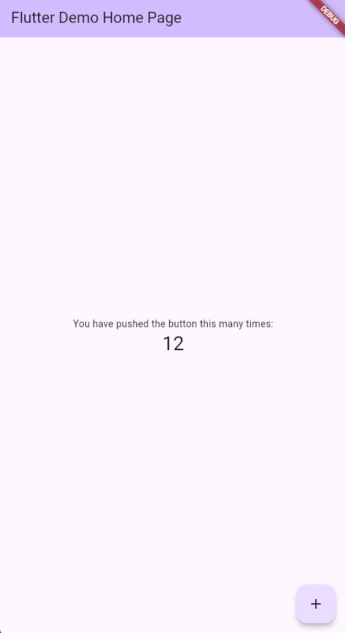

# Organization 

##  TODO List

- Find and configure database ( Firebase Cloud , FlutterFire, free)
- Create database Model

## Object on database: 

+ User App Entity 

| Entité      | Attributs principaux                                                                                           |
|-------------|---------------------------------------------------------------------------------------------------------------|
| **Famille**   | id, nom, adresse, email, téléphone                                                                            |
| **Enfant**    | id, famille_id (FK), prénom, nom, date_naissance, autres infos utiles                                         |
| **Contrat**   | id, enfant_id (FK), date_debut, date_fin, taux_horaire, taux_heure_sup, horaires, gestion_repas, etc.        |
| **Pointage**  | id, contrat_id (FK), date, heure_entree, heure_sortie, heures_normales, heures_supplémentaires               |
| **Repas**     | id, contrat_id (FK), type_repas, tarif, date, commentaire                                                    |
| **FichePaie** | id, contrat_id (FK), mois, annee, total_heures, total_heures_sup, total_repas, montant_total                 |

##  Relation 

Famille 1---N Enfant : Une famille peut avoir plusieurs enfants.

Enfant 1---N Contrat : Un enfant a un (ou plusieurs) contrat(s) (en général un seul actif à la fois).

Contrat 1---N Pointage : Un contrat a de nombreux pointages (entrées/sorties quotidiennes).

Contrat 1---N Repas : Un contrat gère les repas pris par l’enfant.

Contrat 1---N FichePaie : Une fiche de paie est générée chaque mois pour chaque contrat.

**Explications sur la flexibilité**

Contrat : doit contenir les horaires prévus (jours, heures), le taux horaire normal, le taux pour heures sup, les modalités de repas (inclus, facturés, tarifs).

Pointage : permet d’enregistrer les heures d’entrée/sortie chaque jour, pour calculer automatiquement les heures normales et supplémentaires selon le contrat.

Repas : chaque repas pris peut être enregistré, avec le type (déjeuner, goûter…) et le tarif.

FichePaie : regroupe chaque mois le total des heures normales, des heures supplémentaires, des repas, et calcule le montant total à facturer.

## State of Flutter application:

For now, the current state of the application is the basic Flutter version.

